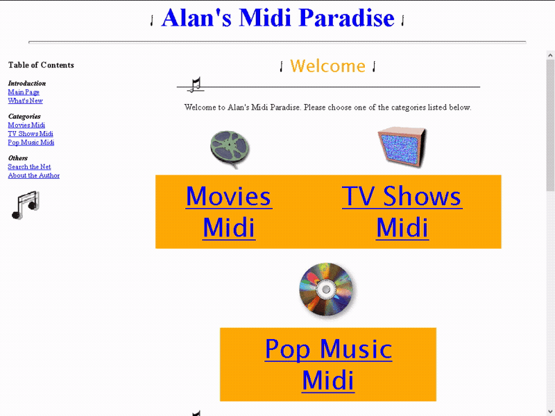

# Eternal Wanderer

A Python bot that generates videos of old web pages and media files archived by the Wayback Machine to then publish them on [Twitter](https://twitter.com/waybackwanderer), [Mastodon](https://botsin.space/@eternalwanderer), and [Tumblr](https://waybackwanderer.tumblr.com).

With over 682 billion web pages saved since 1996, the [Wayback Machine](https://web.archive.org/) is a great resource for exploring the early internet. One project that takes advantage of this archive is [wayback_exe](https://github.com/muffinista/wayback_exe), a bot that generates images of old web pages. The Eternal Wanderer extends this idea and records videos of these old pages so that any audiovisual media like Flash movies, Java applets, VRML worlds, MIDI music, and QuickTime videos can also be experienced.

## Features

* Visits archived web pages and collects metadata from the Wayback Machine's CDX API.

* Records the screen using FFmpeg and generates videos that show the entire page.

* Generates audio recordings of each page using text-to-speech.

* Publishes the recorded videos on Twitter, Mastodon, and Tumblr on a set schedule.

* Designed with now obsolete web plugins in mind. The bot will automatically perform the necessary steps so that old web media plays smoothly (e.g. Flash, Shockwave, Java, VRML, MIDI, RealAudio, QuickTime, etc).

* Supports media files that are linked directly instead of being embedded on the page (e.g. VRML worlds, MIDI music, QuickTime videos, etc).

* Monitors all HTTP/HTTPS requests and archives files that still exist online using the Wayback Machine's Save API.

* Ranks web pages based on specific words and HTML tags.

## Setup

See the [setup page](Source/README.md) to learn how to configure and run this bot.

## Special Thanks

* Special thanks to [muffinista](https://github.com/muffinista) for creating the wayback_exe bot.
* Special thanks to [TOMYSSHADOW](https://github.com/tomysshadow) for creating the Browser Plugin Extender and for his extensive Shockwave knowledge.
* Special thanks to [nosamu](https://github.com/n0samu) for his extensive Mozilla-based browser knowledge.